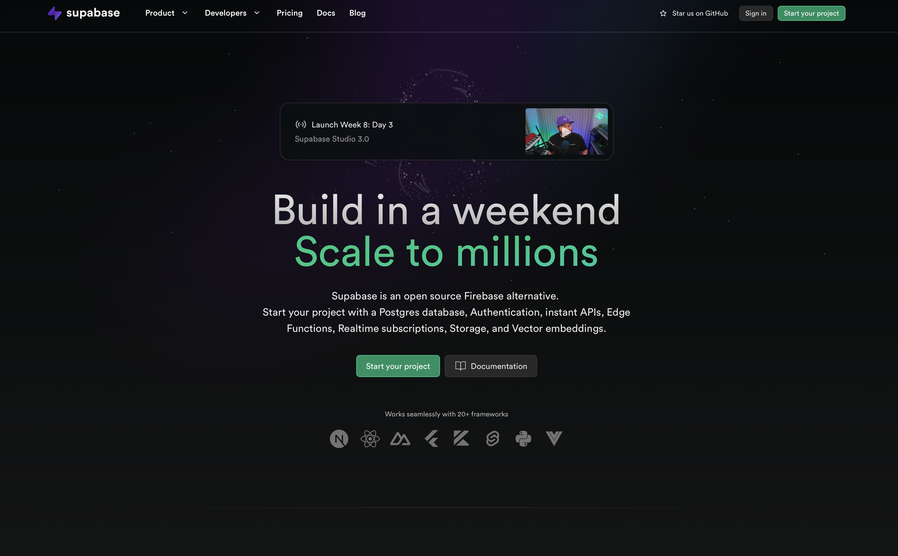
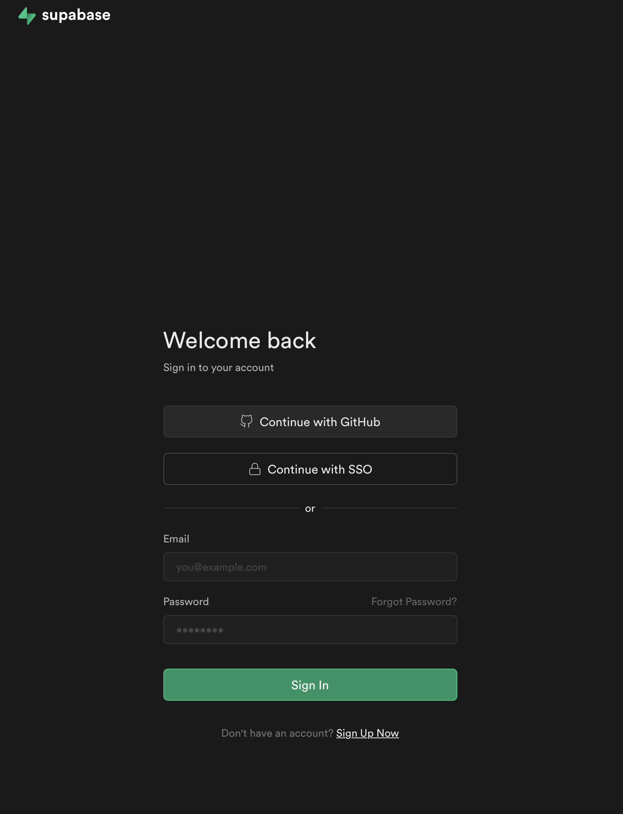
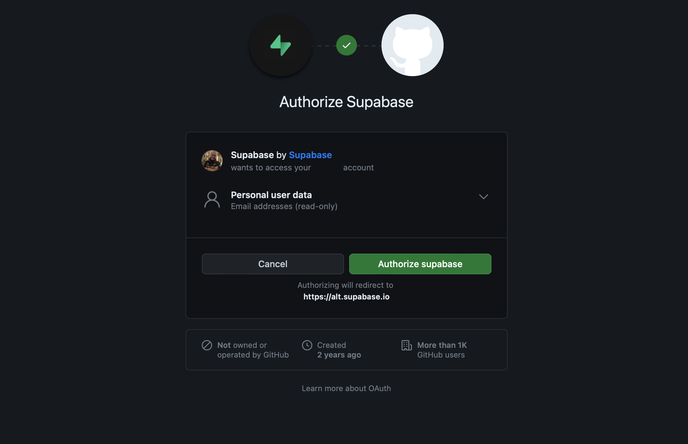
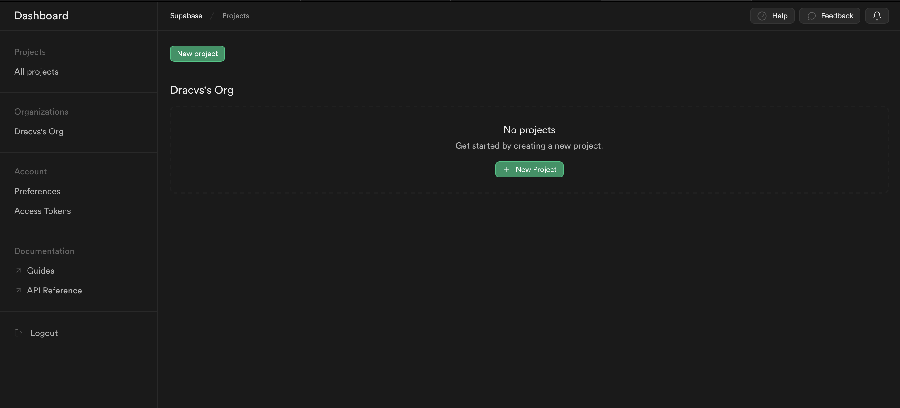
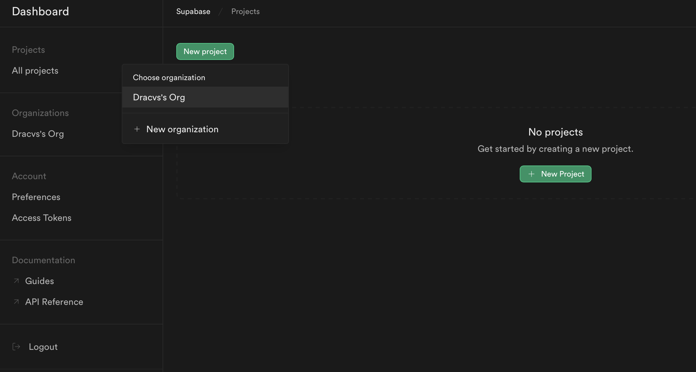
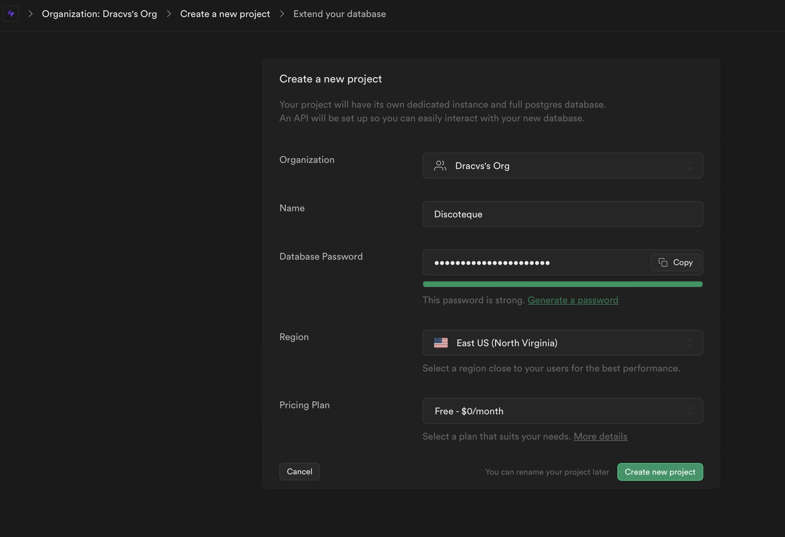
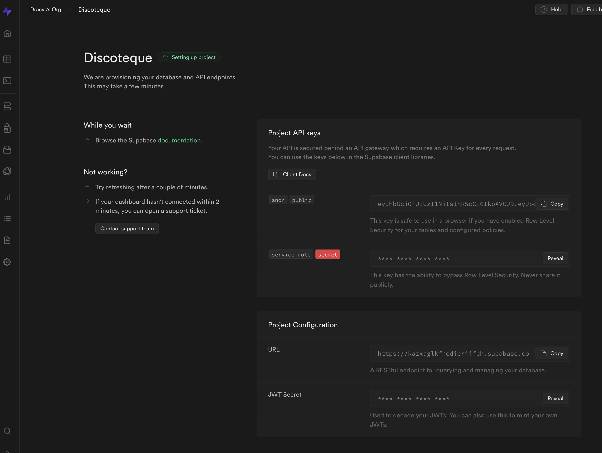
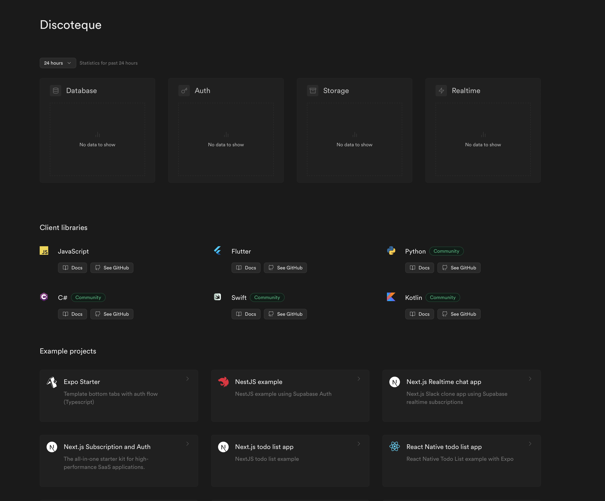
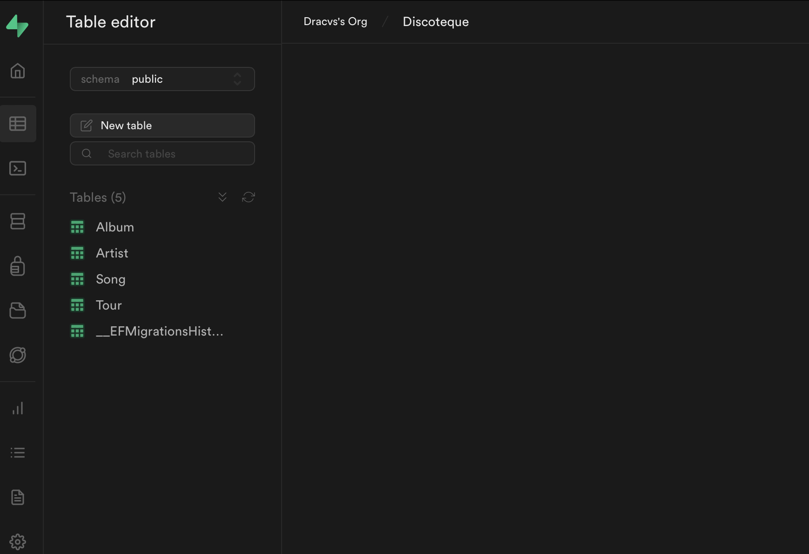

# Connect entity Framework to live Database in Supabase

## Abstract

This instruction manual will outline the steps to create a Entity Framework on a live PostgresDatabase. The steps are equally exchangable to a SQL Server Database.

## Supabase Setup

Supabase is a Postgres online database. It is free on its first tier and can be used to develop small projects and learn how to use it.



- In this case we need to login into supabase with either the github login or a Single Sign On (be it google or something else)





- In the next page we will the main page for the Supabase, in the center there is a Create project button, this is our next stop.







- In this page we will receive the name of the project, the database password and the pricing, we will use Free/0 since our project purpose is entirely academic.

- Once created the new project, we will receive the API keys, (which are the public keys) the service role (which must be kept secret) the URL of the Project and the JWT token Secret.



Following the creation will be the screen where we will work.



## Setting up the EF Project

- First things first we need to find the PostgreSQL Connection String. SupaBase does have a lot of tooling to make things work. but in this project we will learn how to use our UnitofWork, we can use of course the Supabase Tooling instead of our Linq DbContext as well.

- We need to install the following library so we can actually connect to the PGSQL. in both the Data and the API

```bash
dotnet tool install --global dotnet-ef
cd Discoteque.API/
dotnet add package Npgsql.EntityFrameworkCore.PostgreSQL 
cd Discoteque.Data
dotnet add package Npgsql.EntityFrameworkCore.PostgreSQL 
```

- Then we will add the Connection String to our development Json file `appsettings.Development.json`

```json
{
  "Logging": {
    "LogLevel": {
      "Default": "Information",
      "Microsoft.AspNetCore": "Warning"
    }    
  },
  "ConnectionStrings": {
    "DiscotequeDatabase": "Host=[MYSERVER];Username=[MYUSERNAME];Password=[MYPASSWORD];Database=[MYDATABASE]"
  }
}
```

- Remember that these changes MUST NOT be uploaded to the server so always stash them or make them a server variable.

- In the `program.cs` we do the following change to the data connection

```csharp
builder.Services.AddDbContext<DiscotequeContext>(
    opt => {
        opt.UseNpgsql(builder.Configuration.GetConnectionString("DiscotequeDatabase"));
    }    
);
```

- You need to replace the values with the ones provided by Supabase:
  - Host is the key as an URL.
  - Username is usually postgres
  - the post is usually 5432
  - The database is the one you inputted when you created the database proper.
  - Finally the database is the name you gave to your databse, in this case, mine is called Discoteque.

- We then create the first migration for the Database. This is done in the Command console.
- While being in the API project execute the following.

```bash
dotnet dotnet ef migrations add InitialCreate --project ../Discoteque.Data
```

- Before we do the next part, we need to make sure to be using the development environment, if not it will fail.
- First let check wht your ASPNETCORE_ENvironment variable has

```bash
echo $ASPNETCORE_ENVIRONMENT
```

- If you’re using PowerShell in Windows, `execute $Env:ASPNETCORE_ENVIRONMENT = "Development"`

- If you’re using Mac/Linux, execute `export ASPNETCORE_ENVIRONMENT=Development`

```bash
dotnet ef database update
```

- Once you are done you should have the following in your Supabase DB



- We will repurpose a single method for populating the database. We can do this as SQL Script or using the populateDB method, first we need to update our DBContect constructor

```csharp
public DiscotequeContext(
        DbContextOptions<DiscotequeContext> options) 
        : base(options)
    {
        AppContext.SetSwitch("Npgsql.EnableLegacyTimestampBehavior", true);
    }
```

- Once done, you need to comment the PopulateDb in the Program.cs
